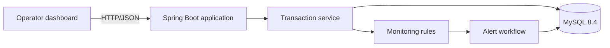

# SecureFlow

[](https://github.com/Neueda-Learning/114-Secure-Flow/actions/workflows/ci.yml)

SecureFlow is a transaction-monitoring and fraud-alert dashboard built with
Java 21, Spring Boot, MySQL, and plain HTML/CSS/JavaScript. It records payments,
evaluates transparent monitoring rules synchronously, creates investigation
alerts, and preserves every alert status change in an audit trail.

## Features

- Create, search, filter, and paginate INR transactions.
- Raise a high-severity alert for amounts strictly above ₹10,000.
- Raise a high-severity velocity alert on the sixth transaction in ten minutes.
- Raise a medium-severity alert for the first payment to an account/payee pair.
- Move alerts through `OPEN → ACKNOWLEDGED → INVESTIGATING → CLOSED` or dismiss
  them from acknowledged/investigating states.
- Require resolution notes for terminal states and retain status history.
- Display live summary cards, transactions, alerts, rules, and responsive forms.
- Expose a documented REST API, application health endpoint, and Swagger UI.
- Apply the MySQL schema automatically with Flyway.
- Build, test, package, and publish a container through GitHub Actions.
- Deploy the application and MySQL together on a Linux VM with Docker Compose.

## Architecture



The browser assets and REST API are delivered by one Spring Boot application.
Transactions are saved and evaluated in the same service operation. Matching
rules create alerts linked to their triggering transactions. See the
[architecture documentation](docs/Architecture/System-Architecture.md) for the
component, database, and deployment views.

## Quick start with Docker

Prerequisites: Docker Engine and the Docker Compose plugin.

```bash
git clone https://github.com/Neueda-Learning/114-Secure-Flow.git
cd 114-Secure-Flow
bash deploy-linux.sh
```

The script creates a private `.env` with a random database password, builds the
application, starts MySQL, applies Flyway migrations, and waits for both health
checks. Open:

- Dashboard: <http://localhost:8080>
- Health: <http://localhost:8080/actuator/health>
- Swagger UI: <http://localhost:8080/swagger-ui.html>

Data is retained in the `secureflow_mysql-data` Docker volume across container
restarts. See the [Linux VM runbook](docs/linux-deployment.md) before deploying
to the presentation VM.

## Local development

Install Java 21 and MySQL 8.4. Create a `secureflow` database and user, then set
credentials for the current terminal.

Windows PowerShell:

```powershell
$env:DB_USERNAME='secureflow'
$env:DB_PASSWORD='your-local-password'
.\mvnw.cmd clean verify
.\mvnw.cmd spring-boot:run
```

Linux/macOS:

```bash
export DB_USERNAME=secureflow
export DB_PASSWORD=your-local-password
./mvnw clean verify
./mvnw spring-boot:run
```

Maven itself does not need to be installed because the repository includes the
Maven Wrapper.

## REST API

| Method | Route | Purpose |
|---|---|---|
| `POST` | `/api/transactions` | Store and evaluate a transaction |
| `GET` | `/api/transactions` | Search/filter/paginate transactions |
| `GET` | `/api/alerts` | Filter and paginate alerts |
| `GET` | `/api/alerts/{id}` | Read alert details, linked transactions, and history |
| `PATCH` | `/api/alerts/{id}/status` | Perform a valid alert status transition |
| `GET` | `/api/rules` | Read the effective monitoring-rule configuration |
| `GET` | `/api/dashboard/summary` | Read current UTC-day dashboard totals |
| `GET` | `/actuator/health` | Read application and database health |

Ready-to-run requests are in [docs/api-examples.http](docs/api-examples.http).

## Quality and delivery

Run the complete local quality gate:

```bash
./mvnw clean verify
```

The build compiles the application, runs automated tests, enforces at least 70%
line coverage for non-trivial backend code, produces a JaCoCo HTML report at
`target/site/jacoco/index.html`, and packages a runnable JAR.

GitHub Actions performs the same verification, smoke-tests the JAR against
MySQL, validates the Compose model, and builds the Docker image. Merges to
`main` also publish the JAR artifact and tagged container images to GitHub
Container Registry.

## Project layout

```text
src/main/java/          Spring controllers, services, rules, repositories
src/main/resources/     Runtime configuration, Flyway SQL, dashboard assets
src/test/               Unit, MVC, persistence, and integration tests
docs/                   Requirements, architecture, testing, API, demo, runbooks
.github/workflows/       Continuous integration and container delivery
Dockerfile               Reproducible multi-stage application image
compose.yaml             Application + persistent MySQL deployment
deploy-linux.sh          One-command Linux VM deployment
```

## Documentation index

- [Business meeting minutes](docs/MoM/MoM-001-Business-Requirements.md)
- [User stories and acceptance criteria](docs/Requirements/User-Stories.md)
- [System architecture](docs/Architecture/System-Architecture.md)
- [Engineering decisions](docs/architecture.md)
- [Testing strategy](docs/Testing/Test-Strategy.md)
- [API examples](docs/api-examples.http)
- [Linux VM deployment](docs/linux-deployment.md)
- [Five-minute demonstration](docs/demo-script.md)
- [Presentation checklist](docs/presentation-checklist.md)
- [Contribution workflow](CONTRIBUTING.md)
- [Security scope](SECURITY.md)

## Scope and security

SecureFlow is a classroom/demo MVP. It deliberately has no authentication,
authorization, encryption termination, editable rule administration, message
queue, or machine-learning model. Restrict VM port `8080` to the presentation
network or your own IP and do not use real financial or personal data.
