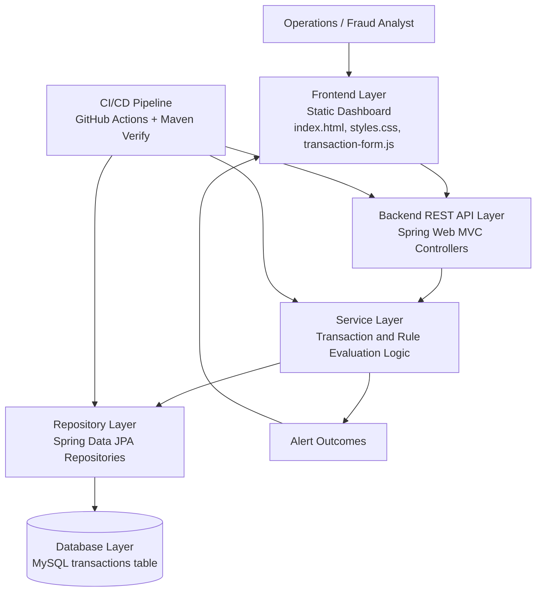

# System Architecture

## System Overview

SecureFlow is a transaction-monitoring system that accepts financial transaction data, applies business-rule-based fraud checks, and exposes monitoring outcomes through a dashboard and API.

The repository currently contains:
- A Spring Boot Web MVC backend.
- A static frontend (HTML/CSS/vanilla JavaScript) served by Spring Boot.
- A MySQL persistence model for transactions (Flyway migration + JPA repository).
- Test execution and packaging through Maven and GitHub Actions CI.

## High-Level Architecture Diagram

## Layered View

### Frontend Layer
- Static assets under src/main/resources/static.
- Provides dashboard UI for monitoring and transaction submission.
- Uses vanilla JavaScript for form submission to backend API endpoints.

### Backend REST API Layer
- Implemented using Spring Boot Web MVC.
- Exposes HTTP endpoints for transaction operations (for example, POST /api/transactions).
- Handles request validation and response mapping.

### Service Layer
- Coordinates transaction creation and business processing.
- Applies normalization and orchestrates interactions between API and repository.
- Serves as the evaluation point for configurable monitoring rules.

### Repository Layer
- Spring Data JPA repository interfaces.
- Encapsulates data access operations for transaction entities.

### Database Layer
- MySQL as the primary runtime datastore.
- Schema managed through Flyway migration scripts.
- Transaction records persisted with key fields (account, payee, amount, currency, times, description).

## Transaction Processing Flow

1. A user submits transaction data from the dashboard or an API client.
2. The REST controller validates and accepts the request payload.
3. The service layer normalizes and prepares the transaction record.
4. The repository layer persists the record to MySQL.
5. The API returns a created response to the caller.

## Fraud Detection Flow

1. A transaction enters processing.
2. Configurable monitoring rules are evaluated against transaction context.
3. Rule outcomes determine whether the transaction is suspicious.
4. The result is propagated for alert handling and monitoring visibility.

## Alert Generation Flow

1. A suspicious outcome is identified during rule evaluation.
2. The system creates alert information according to defined alerting strategy.
3. Alert information is exposed to the dashboard for analyst review.
4. Analysts use the alert list as the operational investigation queue.

## Audit Trail Flow

1. Transaction lifecycle data is persisted with timestamps.
2. Monitoring and alert-related outcomes are retained as reviewable records.
3. Historical records support investigation, compliance checks, and operational traceability.
