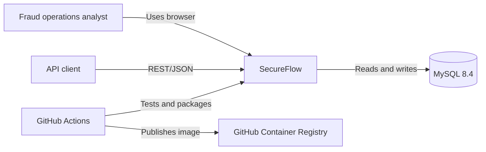
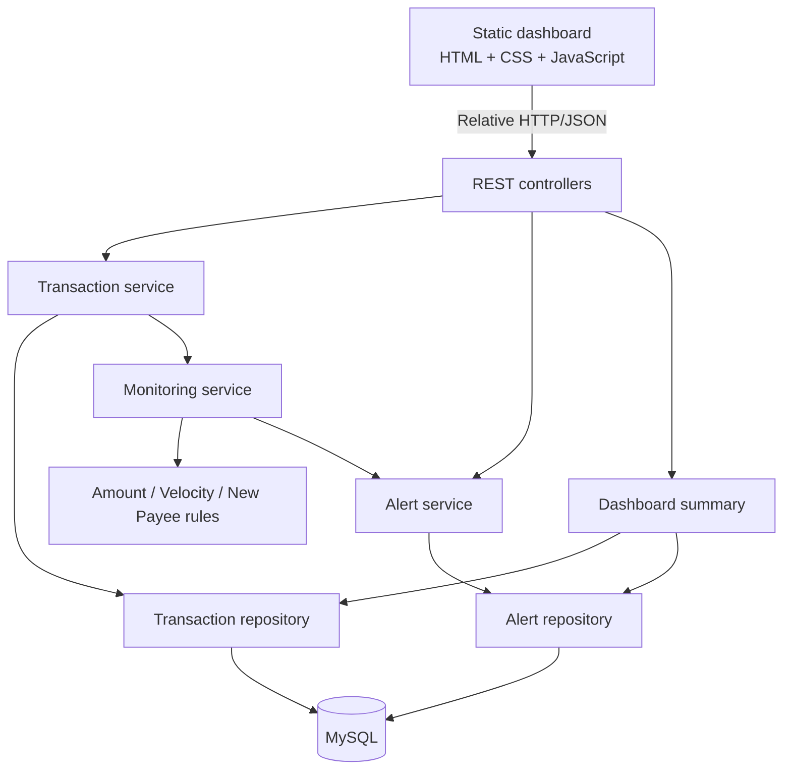
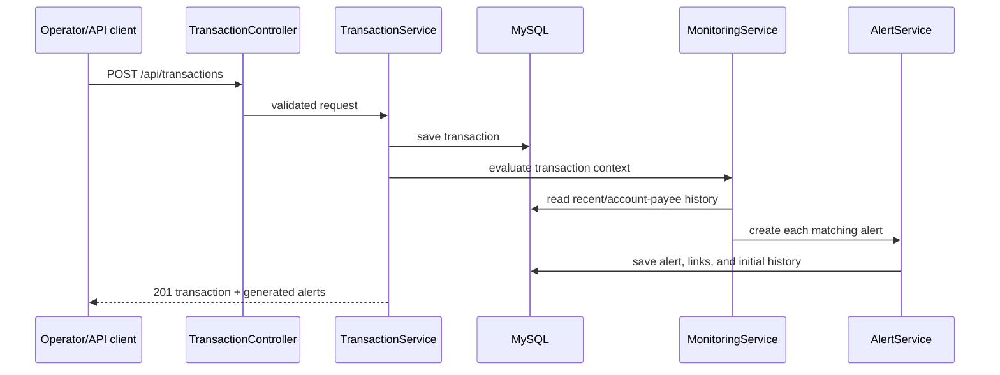
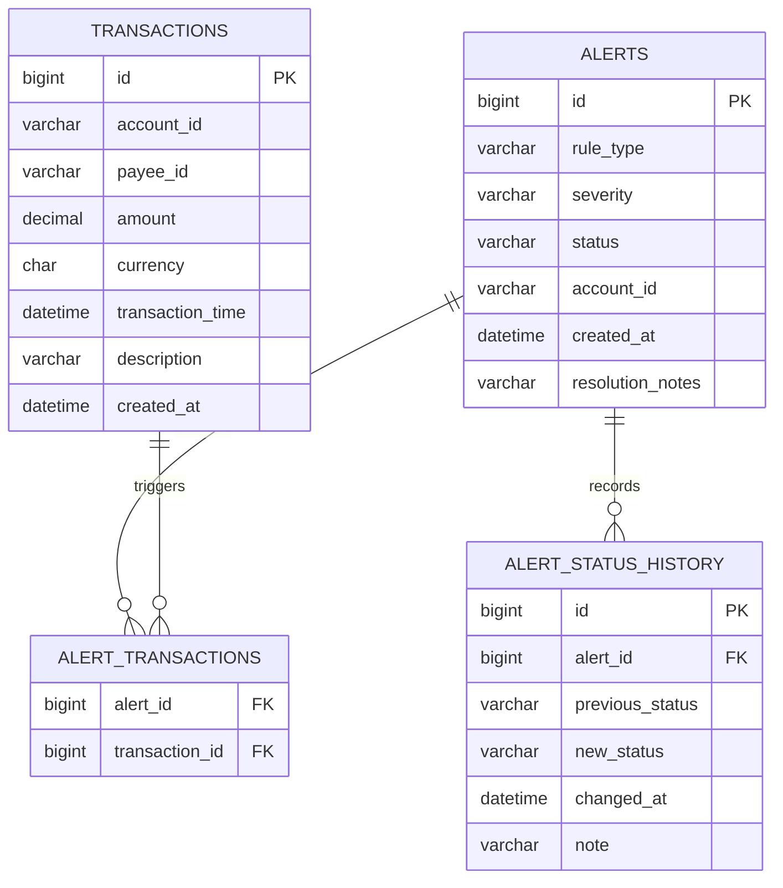
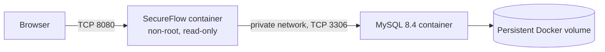

# System Architecture

## System context

The static dashboard and backend are packaged together. The application has no
external runtime dependency beyond MySQL.

## Container and component view

## Transaction and alert sequence

## Database model

## Linux deployment view

Docker publishes only port `8080`. MySQL remains on the private Compose network.
Both services have health checks, bounded memory/logging, and automatic restart
policies.
