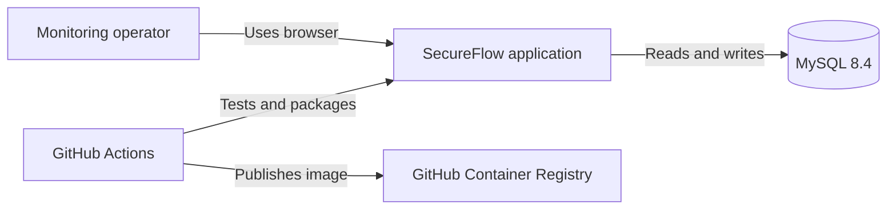
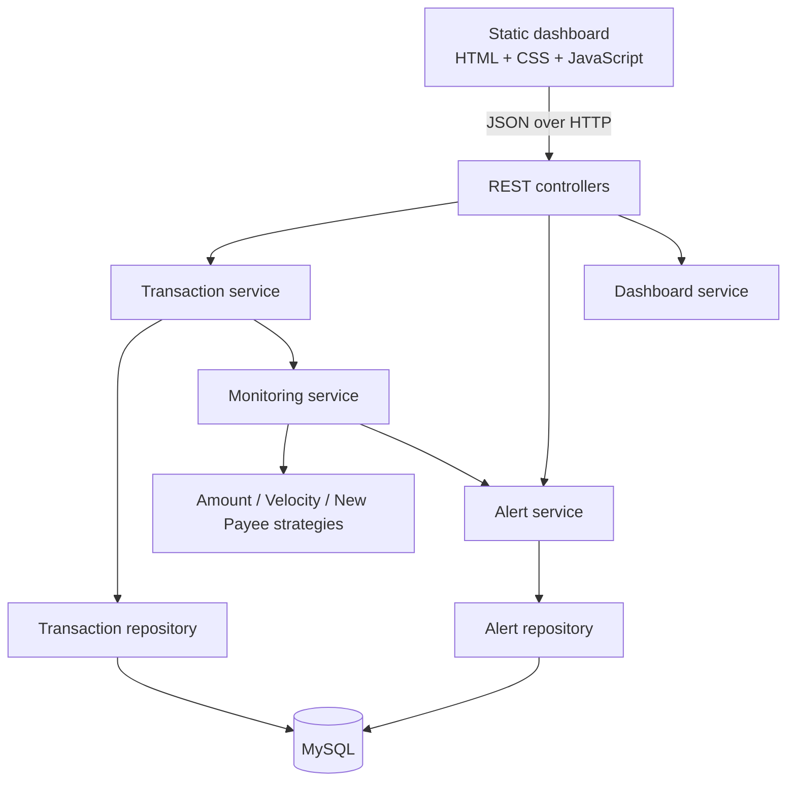
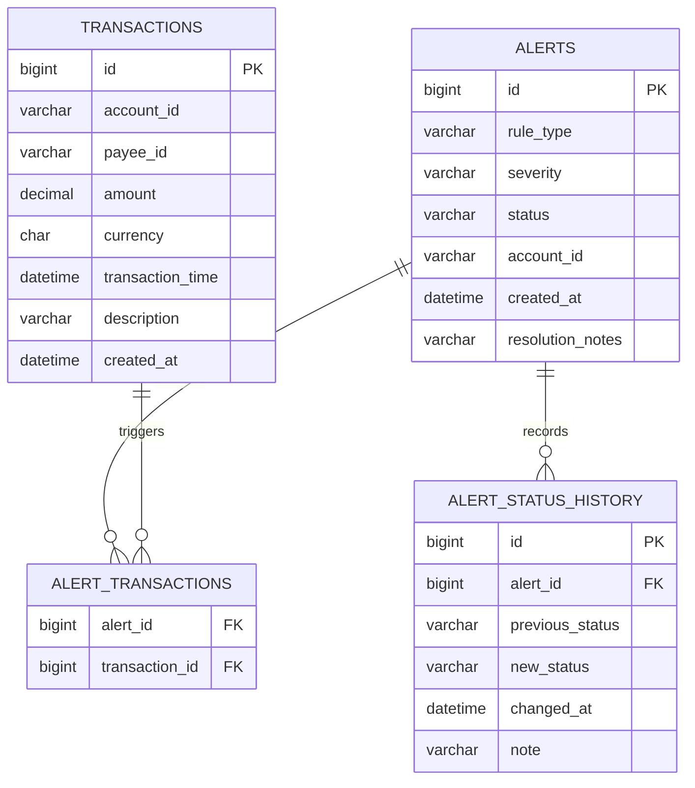

# SecureFlow Architecture

## System context

The current release assumes one trusted operator and has no authentication. The
default Compose deployment therefore binds to localhost; public deployment
requires authentication and HTTPS in front of the application.

## Container/component view

### Why synchronous evaluation?

The transaction is saved and evaluated in one service call. A message queue
would improve scale and separation, but it would also introduce infrastructure,
retry, and eventual-consistency behavior that the current release does not need.
The monitoring rules are strategies, so asynchronous orchestration can replace
`MonitoringService` later without rewriting each rule.

## Database model

Indexes on `(account_id, transaction_time)` and `(account_id, payee_id, transaction_time)` support velocity and payee checks. Instants are stored in UTC to avoid disagreements between machines and keep rolling-window behavior deterministic. The dashboard displays those instants in IST (`Asia/Kolkata`) and calculates “today” from midnight to midnight in India.

## Important behavior

- Money uses `BigDecimal`/`DECIMAL(19,2)`, never floating-point arithmetic.
- DTOs prevent JPA entities and lazy relationships from leaking into JSON.
- Invalid lifecycle transitions return `409 Conflict`; invalid request data returns `400`.
- Closing/dismissing requires meaningful notes and appends history rather than overwriting it.
- Rules are configuration-backed and read-only, limiting scope while making their effective values visible.

## Future options

Possible later releases include editable rules, a daily-limit rule, alert
deduplication, authentication, async events, assignment/SLA support, and
multi-currency conversion.
