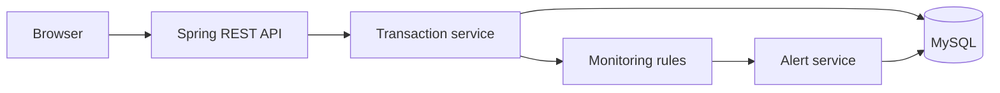

# Architecture

```mermaid
flowchart LR
    Browser --> API[Spring REST API]
    API --> Transactions[Transaction service]
    Transactions --> Rules[Monitoring rules]
    Rules --> Alerts[Alert service]
    Transactions --> MySQL[(MySQL)]
    Alerts --> MySQL
```

The browser sends a transaction to Spring Boot. The transaction is saved, each rule checks it, and matching rules create alerts. Flyway creates the MySQL tables.
